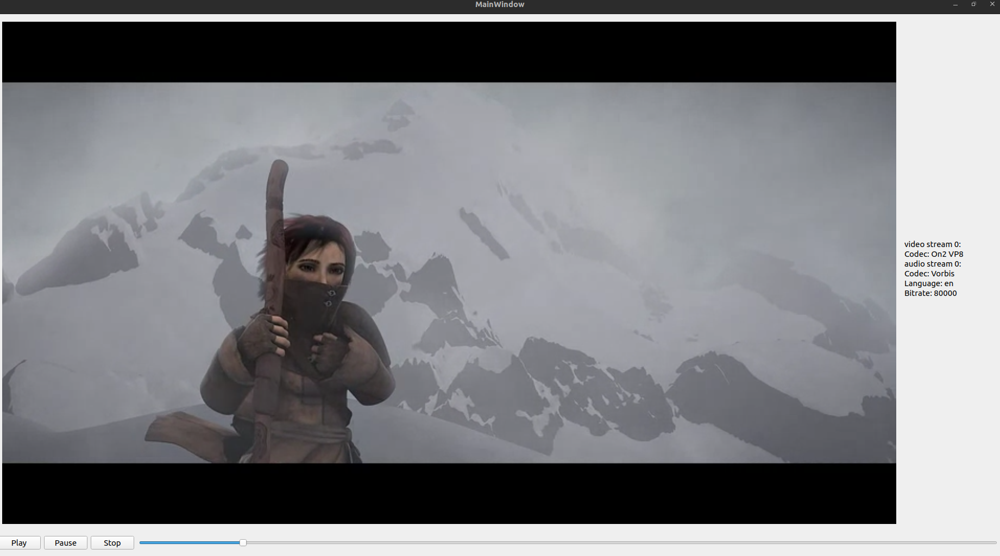

# Demo GStreamer QT GUI Integration

This is a demo project that integrates GStreamer into a Qt GUI. The purpose of this project is to demonstrate how to use GStreamer from within a Qt application.

The project includes a simple GUI application that can play videos and display their frames. The application also includes a simple player that can play videos from network.

